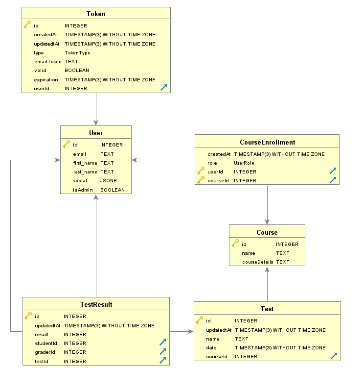

# Grading system app for online courses

App was based on [prisma article](https://www.prisma.io/blog/backend-prisma-typescript-orm-with-postgresql-data-modeling-tsjs1ps7kip1)

The app allows to manage enrollment in online courses, tests (as in exams) for classes, and test results.

The goal if this application is to showcase a real-world scenario of an application using Prisma ORM.
It utilizes email based passwordless authentication.

## Data model



Model is defined in [Prisma schema](./prisma/schema.prisma).
The database schema will be created by Prisma Migrate.

## Tech Stack

- Backend:
  - PostgreSQL
  - Node.js
  - Prisma
  - TypeScript
  - Hapi
  - Jest

## How to use

ALunch database:

```
docker compose up --build
```

Install npm dependencies:

```
npm install
```

Setup app:

```
npm run build
```

Run app:

```
npm start
```
